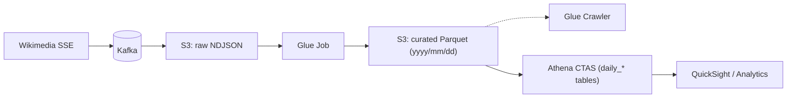

Wiki Lakehouse (Kafka → S3/Glue → Athena)
=========================================

**An end-to-end, containerized pipeline that streams Wikipedia RecentChange events, lands raw data in S3, curates partitioned Parquet with AWS Glue (plus a Glue Crawler), materializes daily aggregates in Athena, and visualizes them in Amazon QuickSight. Orchestrated by Airflow; reproducible with Docker Compose.**

<br> <br>
### Data source
Live events come from Wikimedia’s **EventStreams** (SSE) recentchange feed: [https://stream.wikimedia.org/v2/stream/recentchange](https://stream.wikimedia.org/v2/stream/recentchange).The producer keeps a long-lived connection with polite retries and a descriptive User-Agent, then publishes each JSON event to Kafka.Docs: [https://www.mediawiki.org/wiki/Manual:Contents](https://www.mediawiki.org/wiki/Manual:Contents).

Architecture 
-----------------------------


*   **Kafka**: decouples ingestion from downstream; can replay and scale consumers.
    
*   **S3 (raw)**: cheap, immutable landing; micro-batches by time/size.
    
*   **Glue Job**: normalizes JSON → Parquet; **partitioning** by yyyy/mm/dd for efficient scans.
    
*   **Glue Crawler**: updates the Data Catalog to keep Athena schema in sync.
    
*   **Athena CTAS**: idempotent daily materializations for fast, predictable queries.
    
*   **Airflow**: explicit lineage & retries; easy to extend with new tasks.

*   **QuickSight**: interactive dashboards directly on Athena tables; quick top-N, trends, and drill-downs for sharing.
    

What’s in the repo
------------------
```text
.
├── docker-compose.yml
├── README.md
├── dag/
│   ├── wiki_pipeline_dag.py      # Airflow: Glue → Athena orchestration
│   └── airflow_dag_screenshot.png             # Airflow DAG screenshot
├── kafka/
│   ├── wiki_producer.py              # Wikimedia SSE → Kafka
│   └── wiki_s3_consumer.py           # Kafka → S3 (raw NDJSON, ds=YYYY-MM-DD)
├── glue/
│   └── job_wiki_curate.py            # Glue Spark: raw → curated Parquet (yyyy/mm/dd)
├── upsert_athena_aggregates.py    
│   
└── QuickSight/
    ├── QuickSight_analysis_dashboard_1.png
    ├── QuickSight_analysis_dashboard_2.png
    └── QuickSight_analysis_dashboard_3.png

```


Run it
------

1.  Create .env (same folder as docker-compose.yml):
    
```bash
AWS_ACCESS_KEY_ID=xxx
AWS_SECRET_ACCESS_KEY=xxx
AWS_REGION=us-east-1
S3_BUCKET=wiki-pipline-bucket
```  

2.  Bring up Airflow metadata and user:
    

```bash
docker compose up airflow-init
```  

3.  Start services:
    
```bash
docker compose up -d kafka airflow-scheduler airflow-webserver s3-consumer producer
```  

4.  Orchestrate:
    
```bash
docker compose exec airflow-webserver bash -lc 'airflow dags unpause wiki_pipeline'
docker compose exec airflow-webserver bash -lc 'airflow dags trigger wiki_pipeline'
# UI: http://localhost:8080  (admin / admin)
```  

Inspect data quickly (Athena)
-----------------------------


```sql
-- partitions repaired by the DAG (MSCK)
SELECT date(from_unixtime("timestamp")) AS dt, title, "user", count(*) AS edits
FROM curated
WHERE yyyy=2025 AND mm=9 AND dd=10
GROUP BY 1,2,3
ORDER BY edits DESC
LIMIT 20;

-- daily table created by CTAS task
SELECT * FROM "daily_top_titles_2025_09_10" LIMIT 20;
```

Design notes / thought process
------------------------------

*   **Cost & speed**: Parquet + partition pruning keeps Athena queries cheap and fast.
    
*   **Idempotency**: daily CTAS can re-run safely; raw S3 is immutable for audit/rebuilds.
    
*   **Ops**: backpressure handled at Kafka; retries & alerts via Airflow; schema tracked in Glue Catalog.
    
*   **Extensibility**: add more consumers (e.g., feature store, real-time metrics) without touching the producer.
